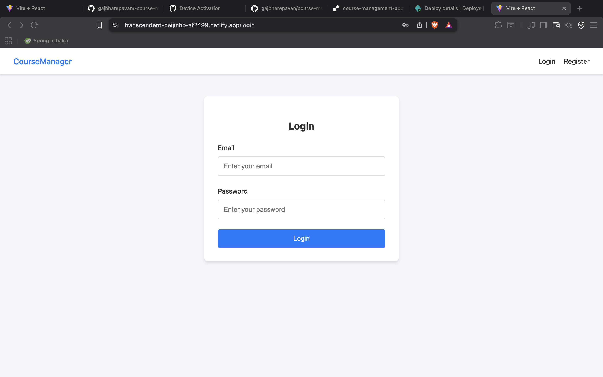
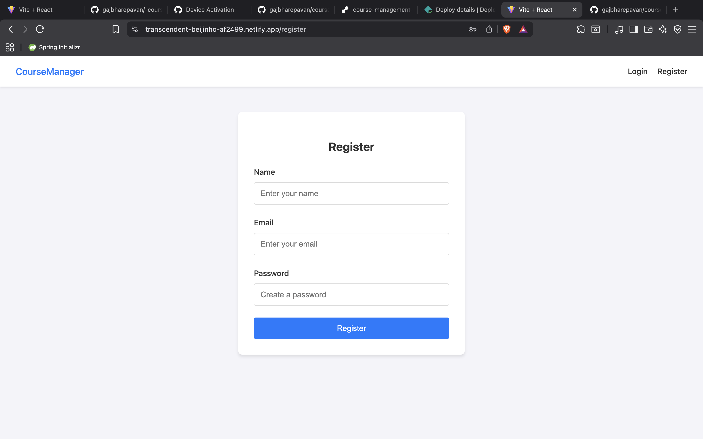
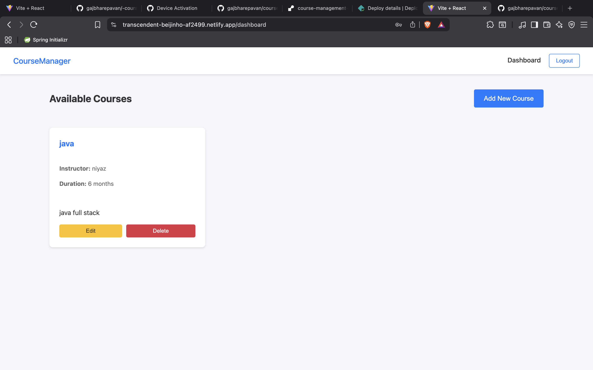
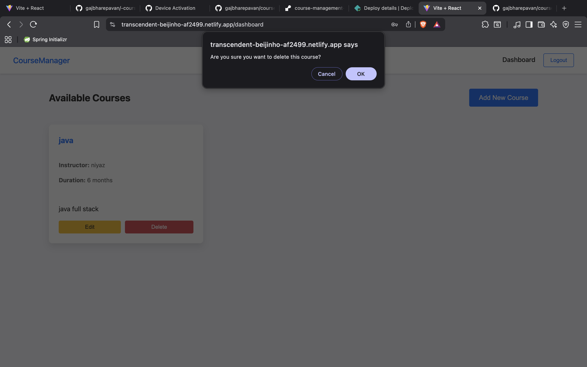

# 📚 Course Management App

A full-stack web application for managing online courses with user authentication and CRUD operations.

## 🛠️ Tech Stack

- **Backend**: Node.js, Express.js, SQLite, JWT, bcryptjs
- **Frontend**: React 18, Vite, React Router, Axios
- **Deployment**: Render (Backend), Netlify (Frontend)

## ✨ Features

- User registration and login with JWT authentication
- Create, Read, Update, Delete courses
- Responsive design for desktop and mobile
- Password hashing with bcryptjs
- Protected routes for authenticated users

## 🚀 How to Run Locally

### Backend
```bash
cd backend
npm install
npm start
```
Server runs on `http://localhost:5001`

### Frontend
```bash
cd frontend
npm install
npm run dev
```
Frontend runs on `http://localhost:5173`

## 🌐 Live Links

- **Frontend**: https://transcendent-beijinho-af2499.netlify.app
- **Backend API**: https://course-management-app-uk61.onrender.com
- **GitHub**: https://github.com/gajbharepavan/course-management-app

## 📸 Screenshots









## 🔐 API Endpoints

| Method | Endpoint | Description |
|--------|----------|-------------|
| POST | `/api/auth/register` | Register new user |
| POST | `/api/auth/login` | User login |
| GET | `/api/courses` | Get all courses |
| POST | `/api/courses` | Create course (auth required) |
| GET | `/api/course/:id` | Get single course |
| PUT | `/api/course/:id` | Update course (auth required) |
| DELETE | `/api/course/:id` | Delete course (auth required) |

## 📁 Project Structure

```
course-management-app/
├── backend/
│   ├── config/database.js
│   ├── models/user.js, course.js
│   ├── routes/auth/, course.js, courses.js
│   ├── index.js
│   └── package.json
└── frontend/
    ├── src/pages/, components/
    ├── src/api.js
    ├── App.jsx
    └── package.json
```

## 📋 Environment Variables

```
# Backend .env
PORT=5001
NODE_ENV=development
JWT_SECRET=your_secret_key
```

## 🚢 Deployment

**Backend (Render)**:
- Set root directory to: `backend`
- Build command: `npm install`
- Start command: `npm start`

**Frontend (Netlify)**:
- Set base directory to: `frontend`
- Build command: `npm run build`
- Publish directory: `dist`

---

**Last Updated**: January 4, 2026
